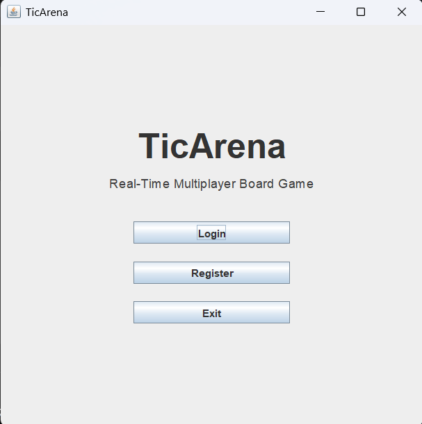
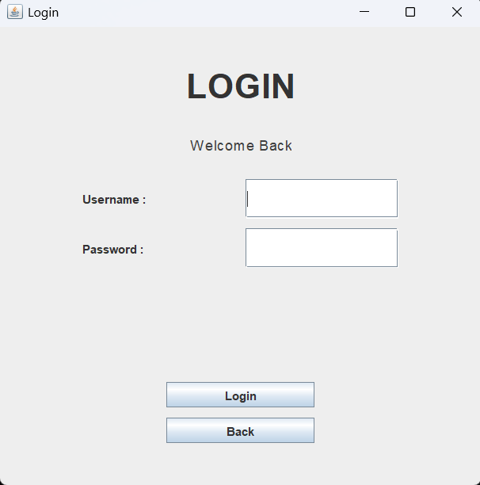
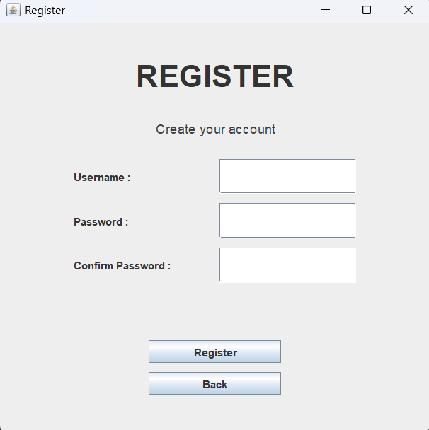
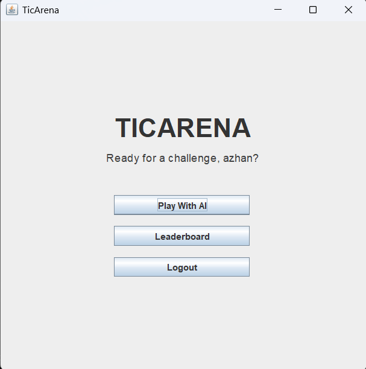
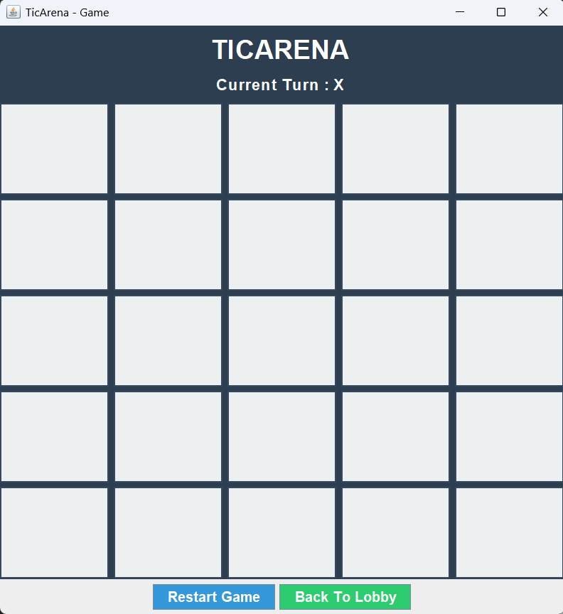
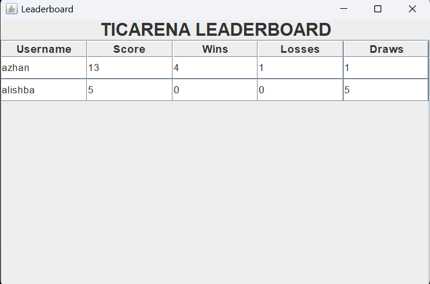

# 🎮 TicArena AI Edition

A Java-based 5×5 Tic Tac Toe game developed using Java Swing, JDBC, and MySQL. TicArena AI Edition features secure user authentication, persistent player statistics, a leaderboard system, and a smart AI opponent capable of detecting winning opportunities and blocking player threats.

---

## 🚀 Features

### 👤 User Authentication

* User Registration System
* Secure Login Functionality
* MySQL Database Integration
* Persistent User Records

### 🎯 Gameplay

* 5×5 Tic Tac Toe Board
* Turn-Based Gameplay
* Win Detection System
* Draw Detection System
* Restart Game Functionality
* Back-to-Lobby Navigation

### 🤖 Smart AI Opponent

The AI follows a decision-making strategy:

1. Checks for a winning move and plays it immediately.
2. Detects and blocks potential player wins.
3. Chooses a valid move when no immediate threat exists.

This creates a challenging gameplay experience while maintaining efficient performance.

### 📊 Statistics & Leaderboard

* Win Tracking
* Loss Tracking
* Draw Tracking
* Score Calculation
* Dynamic Leaderboard
* Persistent Statistics Stored in MySQL

---

## 🛠 Technologies Used

* Java
* Java Swing
* JDBC
* MySQL
* Git
* GitHub

---

## 📸 Screenshots

### Welcome Screen



### Login Screen



### Registration Screen



### Lobby



### Game Board



### Leaderboard



---

## 🗄 Database Schema

### users

| Column     | Description           |
| ---------- | --------------------- |
| id         | Unique User ID        |
| username   | Player Username       |
| password   | User Password         |
| score      | Total Score           |
| wins       | Number of Wins        |
| losses     | Number of Losses      |
| draws      | Number of Draws       |
| created_at | Account Creation Time |

---

## 🏗 Project Architecture

```text
TicArena
│
├── gui
│   ├── WelcomeFrame
│   ├── LoginFrame
│   ├── RegisterFrame
│   ├── LobbyFrame
│   ├── GameFrame
│   └── LeaderboardFrame
│
├── database
│   ├── DBConnection
│   └── UserDAO
│
└── main
    └── Main
```

---

## ▶ How to Run

1. Clone the repository:

```bash
git clone <repository-url>
```

2. Create the MySQL database.

```sql
CREATE DATABASE ticarena;
```

3. Configure database credentials in:

```text
src/database/DBConnection.java
```

4. Compile the project.

```bash
javac -cp "lib/*" -d bin src/database/*.java src/gui/*.java src/main/*.java
```

5. Run the application.

```bash
java -cp "bin;lib/*" main.Main
```

---

## 🎓 Learning Outcomes

This project helped strengthen understanding of:

* Object-Oriented Programming (OOP)
* Java Swing GUI Development
* JDBC Database Connectivity
* SQL Query Handling
* Event-Driven Programming
* Game Logic Design
* Git & GitHub Version Control

---

## 🔮 Future Enhancements

* Multiple AI Difficulty Levels
* Online Multiplayer Support
* Friend Match System
* Player Profiles
* Sound Effects and Animations
* Advanced Analytics Dashboard

---

## 👨‍💻 Author

**Md Azhan Sarfaraz**
B.Tech Computer Science & Engineering
Passionate about Software Development, Artificial Intelligence, and Problem Solving.
